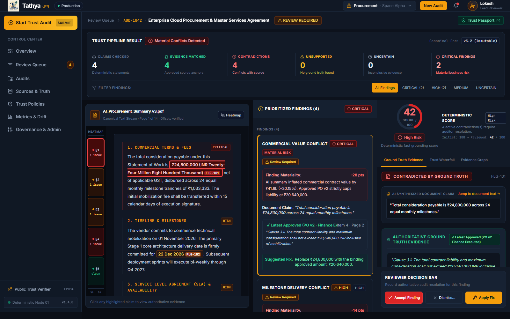
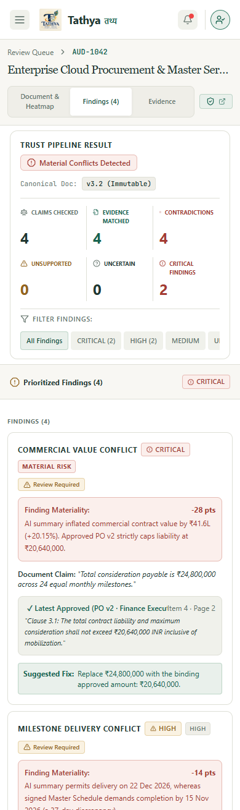
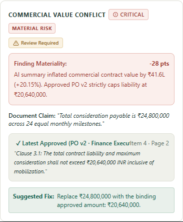
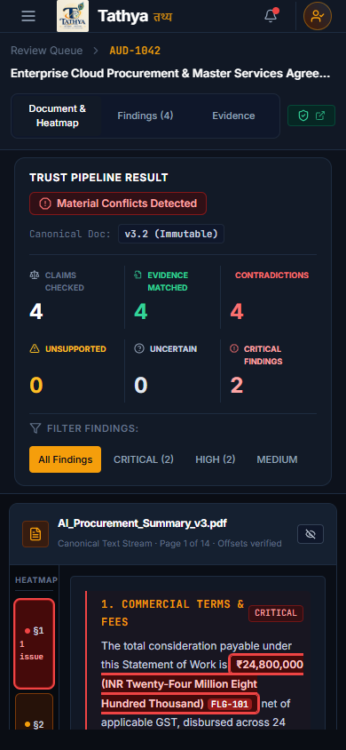
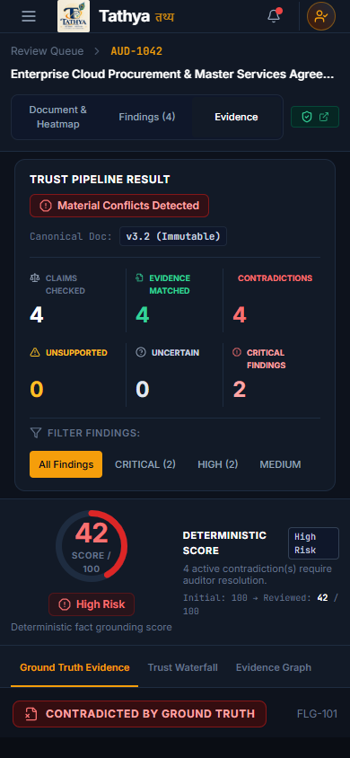
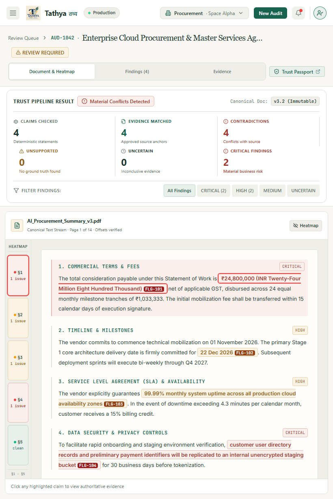

# TATHYA — Phase 3 visual polish

Branch: `feat/dhanesh-web-ux`
Base: `8152756` (existing Phase 3 implementation)

Polish commit: `d66d70e` (report-only follow-up follows this commit).
Owner: Dhanesh web UI/UX

This change polishes the existing result, heatmap, finding, evidence and review workspace presentation. It preserves the branch's navy/amber identity and centralized tokens. It does not replace the active frontend on main.

## Changes

- Compact result metrics with clear separators, smaller mobile summary and accessible filter targets.
- Findings precede the reviewer checklist, keeping the issue and explanation immediately visible.
- Selected cards use a restrained accent edge; document typography and evidence excerpts have consistent readable spacing.
- Desktop panel proportions are 40% document, 29% findings and 31% evidence.
- Tablet/mobile retain the existing panel switcher with corrected flex layout and scrollable content.
- Heatmap exposes pressed state and keyboard tooltip; document scrolling respects reduced motion.
- All styling is scoped to the workspace. Shared themes, layouts, API contracts, API client, score bands, upload flow, authentication, verifier, mobile and backend were not edited.

## Screenshots

These screenshots show the existing development adapter's sample audit, not live backend results.

## Validation

Run `npm run build` and `node tests/phase3-polish.cjs` with Playwright available. For the local shared installation, set `NODE_PATH` to the parent repository's node_modules directory. The branch has no configured lint or test script; the browser check is supplied separately and uses the repository's centralized adapter.

Browser regression checks cover selection synchronization, keyboard heatmap activation, toggling, filters, waterfall/graph tabs, 390px layout, tablet layout, reviewer accept/dismiss/fix, dismissal-note validation, login/submit/queue/verifier route loading and audit-not-found. No uncaught browser errors occurred. Route loading is not a complete live authentication or backend integration test.

## Remaining Phase 3 foundation gaps (inherited, preserved)

This is a presentation polish, not a claim that the entire original Phase 3 specification is complete.

1. `DocumentHeatmapGutter` associates findings with sections by array order. It is not a canonical PDF bbox / DOCX character / spreadsheet cell heatmap.
2. `DocumentViewer` contains fixed hero document sections and uses substring matching for synthesized text. Arbitrary documents and multiple findings in the same segment need a location-contract implementation.
3. Workspace summary falls back to derived counts and severity-based verification assumptions; missing claim counts can default to four. These are not authoritative backend values.
4. `ResultSummaryBar` has no explicit FAILED branch and treats READY as conflicts; its no-findings copy overstates certainty. Full honest state coverage requires a separate contract/presentation correction.
5. Evidence defaults to severity-derived relationships; source metadata uses the first source rather than matching the selected evidence's source ID. Source location display exists, but a source document navigation/viewer flow is not implemented.
6. Existing reviewer decisions and scoring operate through the development adapter. No live persistence or final trust-engine claims are made.
7. The actual branch uses React Router, `src/pages` and `src/components/workspace`, not the conceptual TanStack/route folder structure in the brief. The existing architecture was preserved.
8. The canonical location types currently use camelCase character offsets and optional PDF bbox. Contract reconciliation belongs with the API owner.
9. `AUD-1042` occurs in centralized sample data and API documentation. A hard-coded legacy passport token remains in workspace UI and sample viewer sections remain in production source; adapter isolation still needs review before release.

## Backend handoff

Harshit should supply authoritative result summaries/states, explicit verification relationships, canonical document and source locations, document content/version IDs, evidence-to-source IDs and reviewer guidance. Do not infer these from severity or fill absent data with demo values. The centralized client is currently an in-memory adapter; no network API dependency was introduced by this polish.

## Required Phase 3 report

| Check | Result |
| --- | --- |
| Laptop | Dhanesh web UI/UX scope |
| Branch | feat/dhanesh-web-ux |
| Result View | PASS existing view visually polished; full state contract incomplete |
| Heatmap | FAIL full exact-location requirement; existing section gutter regression PASS |
| Highlights | FAIL arbitrary canonical-location requirement; existing hero interaction PASS |
| Finding ↔ Document | PASS existing hero flow only |
| Finding ↔ Evidence | PASS existing adapter selection flow |
| Document ↔ Evidence | FAIL full source-document navigation requirement |
| Review Workspace | PASS visual polish and preserved interactions |
| What-to-Check | PASS preserved; visually placed after findings |
| Supported / Contradicted / Unsupported / Uncertain | FAIL authoritative relationship fallback requirement |
| Loading | PASS existing spinner preserved; granular skeletons not implemented |
| Partial | FAIL complete contract validation not established |
| Empty | FAIL certainty wording needs correction |
| Error | PASS audit-not-found; other backend states not fully verified |
| Responsive | PASS 390px / 820px / 1600px browser checks |
| Accessibility | PASS tested keyboard heatmap and existing card activation; no full audit claimed |
| AUD-1042 production dependency | PRESENT sample adapter; legacy hero logic noted above |
| Secp256k1 | NONE |
| Merkle | NONE |
| Blockchain product claim | NONE |
| TypeScript | PASS build compiler |
| Lint | NOT CONFIGURED in this branch |
| Tests | PASS browser regression checks |
| Production Build | PASS; existing bundle-size warning |
| Browser QA | PASS scoped regression; no uncaught errors |
| Backend dependency | TEMP ADAPTER |
| Remaining blockers | Canonical locations, authoritative states/counts, source navigation, live integration |
| GitHub push | PASS; visual polish commit `d66d70e` |

The PASS labels above apply only to the stated tested scope. Inherited gaps are deliberately reported instead of being silently rewritten during a functionality-preserving polish.
